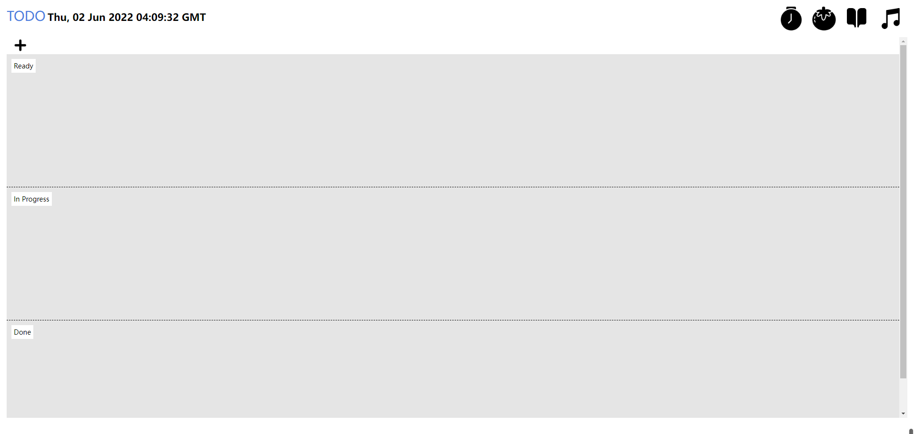
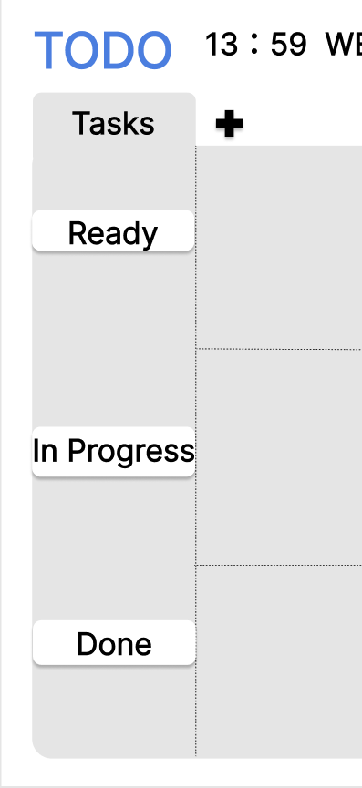
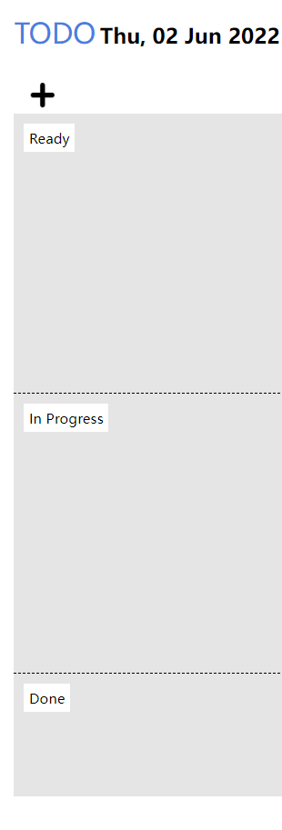
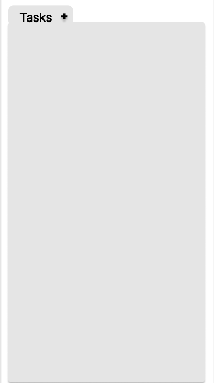
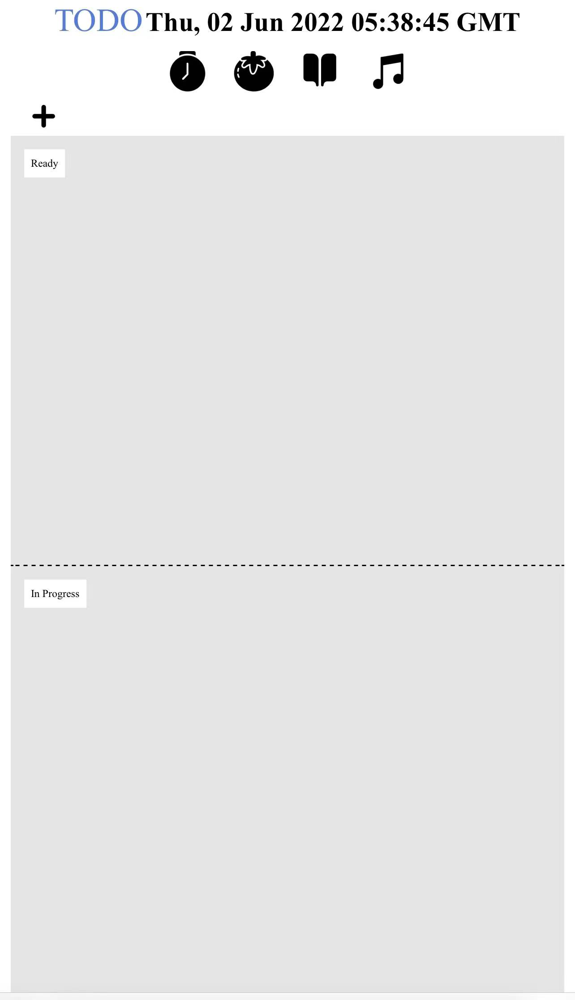
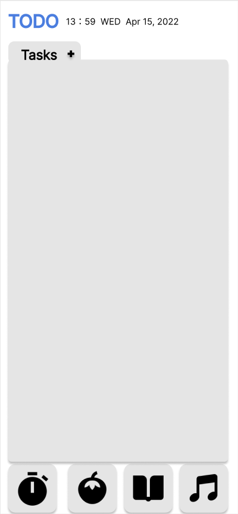

# Explanation of design
## TODO
TODO is a software designed by me to help students improve their learning efficiency by making study plans. It contains a scheduler, stopwatch, tomato clock, dictionary and music playback functions. At the beginning of the design, I chose white and gray as the main colors, while I chose blue for the TODO logo and some special buttons to keep it in harmony with other elements while keeping it fresh for the user. The whole design principle is simple, clear and convenient. The top left corner of the main page is TODO's logo and time information, and the top right corner is four learning AIDS. The study plan takes up most of the page, which helps the user to get a clearer picture of what to do next.

## Feedback & Development
Before editing the code for the final design, I sent the design drawings of the previous assignment to five users and asked them to give me some feedback. I summarized their main comments as the interface inconsistency between mobile and web and the unreasonable distribution of some elements.
1. Delete 'TASK' and shrink 'READY' IN PROGRESS' 'DONE'
‘The task below the LOGO and the three phases that show the plan status take up too much space.’

2. Keep 'READY', 'IN PROGRESS', 'DONE' in mobile devices
‘The parts of the three display planning stages on Mobile Devices are missing and should be consistent with those on desktop. ’

3. Change four buttons on mobile devices
'Usually at the bottom of the mobile devices is the paging button, where the four functional buttons shouldn't be. '

## Self-reflection & Challenges

In the process of this design, the biggest challenge I faced was how to let users understand the functions and operation methods of the software as soon as possible without any hints. I try to simplify the page as much as possible to help the user see clearly what each part does. Finding the right balance between feature-rich and easy to use can be difficult, and sometimes users get confused because there are so many features. I think my interface looks a little dull, but this may be influenced by my desire to make the user more aware of the function. I may change some details in the future, such as color, key position and font, etc

## References

> iconfont-阿里巴巴矢量图标库. (2022). Retrieved 2 June 2022, from https://www.iconfont.cn/
> 
> QQ音乐-千万正版音乐海量无损曲库新歌热歌天天畅听的高品质音乐平台！. (2022). Retrieved 2 June 2022, from https://y.qq.com/?ADTAG=myqq#type=index
> 
> Free Dictionary API. (2022). Retrieved 2 June 2022, from https://dictionaryapi.dev/
